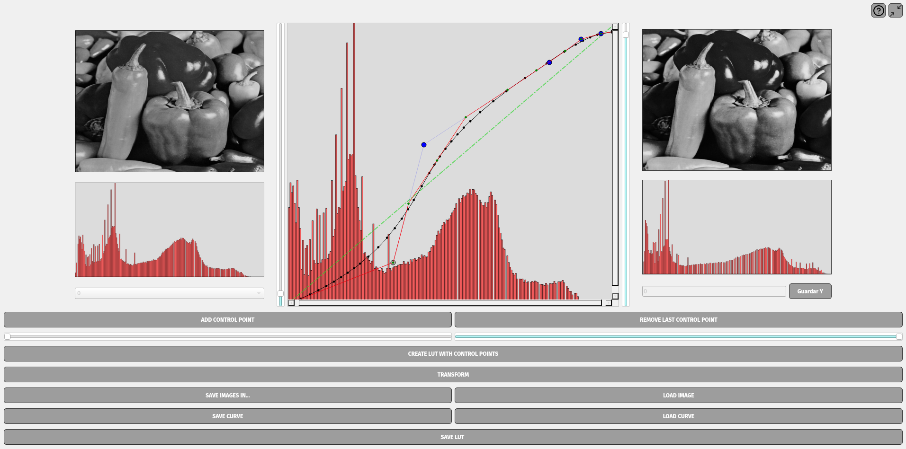

# histogram-simulator
An application to perform LUT-based image histogram modification interactively

  

This project uses [OpenCV 4](https://github.com/opencv/opencv/tree/4.10.0) (see additional packages in https://docs.opencv.org/3.4/d7/d9f/tutorial_linux_install.html)

It is recommended build OpenCV with `-DOPENCV_GENERATE_PKGCONFIG=ON`, see [this](https://stackoverflow.com/questions/15320267/package-opencv-was-not-found-in-the-pkg-config-search-path)

References:
- Bézier curves approximation thanks to the work of [Maxim Shemanarev](https://agg.sourceforge.net/antigrain.com/research/adaptive_bezier/)

_TODO_:

- The idea will be binding all required libraries into a single AppImage, in order to ship the application directly
- Refractor directories in modules
- Add safety in TRANSFORM button and other places
